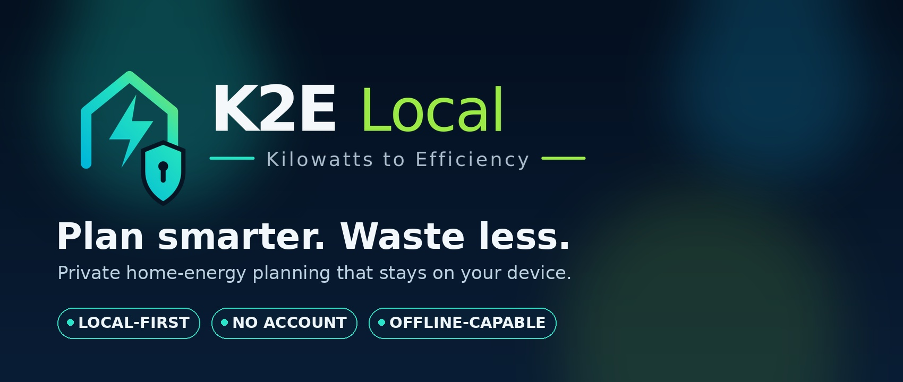

# K2E Local



**Kilowatts to Efficiency**

K2E Local is a privacy-first home-energy planning app that runs locally in the browser. It helps households estimate electricity use, explore costs, compare scenarios, and review appliance insights without requiring an account or sending household details away from the device.

[**Launch K2E Local →**](https://nrg-roan.vercel.app/)

**Private by design · Local-first · Offline-capable · No account required**

## Highlights

- Plan household energy use with clear summaries and visual breakdowns
- Estimate daily and monthly electricity costs
- Compare saved homes and scenarios
- Review appliance insights and action guidance
- Keep household data on the device unless the user exports it

## Modes

### Simple Mode
A guided workflow for quick setup, clean results, and everyday planning.

### Advanced Mode
Deeper analysis with scenarios, comparisons, reporting, scheduling, and more control.

## Privacy and offline use

K2E Local is built to work locally in the browser. After the first successful load, the core app shell and bundled assets can continue to work offline. No account is required.

## Deployment

This repository is prepared for GitHub Pages through the included GitHub Actions workflow.

1. Upload the contents of this package to the repository root.
2. Commit and push to the `main` branch.
3. In **Settings → Pages**, select **GitHub Actions** as the source.
4. Open the deployment at [https://nrg-roan.vercel.app/](https://nrg-roan.vercel.app/).

The public entry page is `index.html`; the simulator is `app.html`.

## Local preview

Run the repository through a local HTTP server so the service worker can operate:

```bash
python3 -m http.server 8080
```

Then open `http://localhost:8080`.

## Validation

```bash
node scripts/validate-release.mjs
```

## Repository presentation

- README hero image: `assets/k2e-local-readme-banner.jpg`
- Primary header logo: `assets/k2e-logo-horizontal-dark.png`
- Light-background logo: `assets/k2e-logo-horizontal-light.png`
- App/icon mark: `assets/k2e-logo-app-icon.png`
- Brand identity board: `assets/k2e-brand-identity-board.png`
- Social/share preview image: `assets/k2e-local-social-preview-v1.14.1.png`
- Optional GitHub repository social preview upload: `GITHUB_SOCIAL_PREVIEW_UPLOAD.png`

## Current release

**v1.14.3 — Refined K2E Brand Identity**

- Introduces a simplified professional logo system for headers, icons, light/dark use, and brand presentation
- Replaces the homepage header logo and app icons with the refined K2E identity
- Updates the README banner to match the new visual system
- Preserves the working v1.14.1 Facebook/social preview and the brighter homepage borders

## Project notes

Development handoff details are available in [`docs/NEXT_HANDOFF.md`](docs/NEXT_HANDOFF.md).

## Licensing

No open-source license has been selected. Add a `LICENSE` file before inviting unrestricted reuse or outside contributions.
