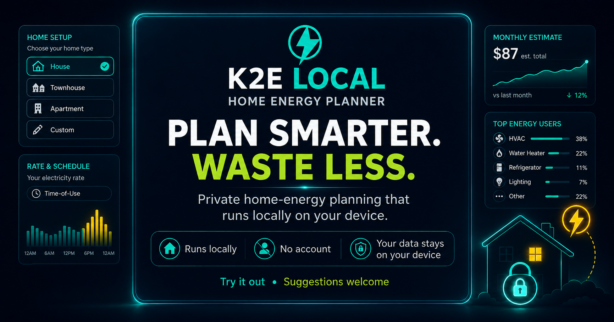

# K2E Local



**Kilowatts to Efficiency**

K2E Local is a local-first household energy simulator for planning electricity use, estimating costs, comparing scenarios, and reviewing appliance insights privately on your device.

[**Launch K2E Local →**](https://scar197124.github.io/K2e-local/)

**Local-first · Offline-capable · No account required**

## What it does

- Models household devices and electricity use
- Estimates daily and monthly energy costs
- Compares saved homes and scenarios
- Highlights major energy contributors
- Produces structured local guidance and action plans
- Keeps household data in the browser unless the user exports it

## Modes

**Simple Mode** provides a guided setup and clear summary.

**Advanced Mode** adds scenarios, deeper analysis, comparisons, reports, schedules, and data portability.

## Privacy and offline use

K2E Local is designed to work locally in the browser. After the first successful load, the application shell and bundled chart library can operate offline. No account is required.

## Deployment

This repository is prepared for GitHub Pages through the included GitHub Actions workflow.

1. Upload the contents of this folder to the repository root.
2. Commit and push to the `main` branch.
3. In **Settings → Pages**, select **GitHub Actions** as the source.
4. Open the deployment at [https://scar197124.github.io/K2e-local/](https://scar197124.github.io/K2e-local/).

The public entry page is `index.html`; the simulator is `app.html`.

## Local preview

Run the repository through a local HTTP server so the service worker can operate:

```bash
python3 -m http.server 8080
```

Then open `http://localhost:8080`.

## Validation

```bash
node scripts/validate-release.mjs
```

## Current release

**v1.12.9 — Repository and README Cleanup**

- Replaces the duplicated historical README with one clear public-facing document.
- Removes obsolete release-note and one-off repair files from the GitHub-ready folder.
- Preserves the working app, social preview, deployment workflow, offline assets, and current public URL.
- Makes no calculation or interface changes.

See [`RELEASE_NOTES_v1.12.8.md`](RELEASE_NOTES_v1.12.8.md) for the release summary.

## Project notes

Development handoff details are available in [`docs/NEXT_HANDOFF.md`](docs/NEXT_HANDOFF.md).

## Licensing

No open-source license has been selected. Add a `LICENSE` file before inviting unrestricted reuse or outside contributions.
